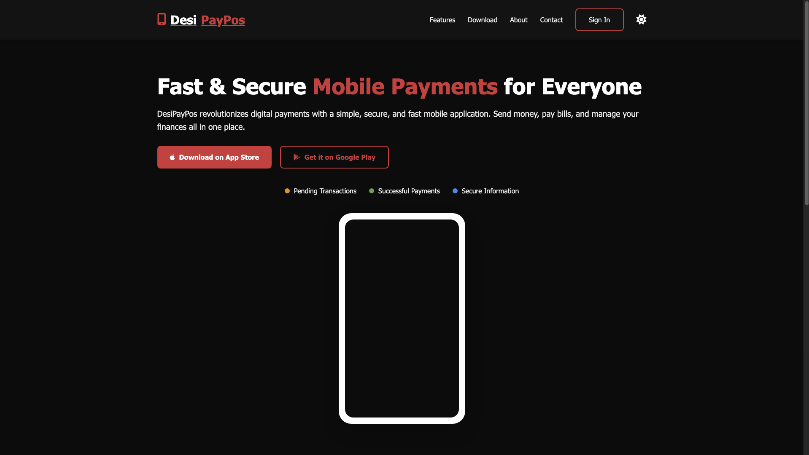
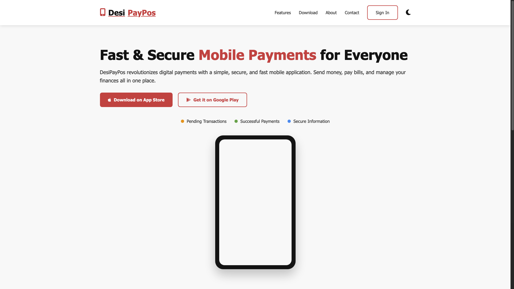

# Features of this DesiPayPos Web Application:

1. Responsive Design - Works perfectly on all screen sizes from mobile to desktop
2. Dark/Light Mode Toggle - Switch between themes with a single click
3. Black/Red/White Theme - Consistent color scheme throughout
4. Authentication Modal - Sign in and Sign up functionality
5. App Store Download Simulation - Buttons for Apple App Store and Google Play
6. Status Color Indicators - Using the specified colors:
  - Warning: Orange
  - Danger: Red
  - Success: Green
  - Info: Blue

7. Interactive Elements:
  - Mobile menu for smaller screens
  - Form validation for auth forms
  - Hover effects and animations
  - Theme persistence using localStorage

The design is modern, clean, and focused on the DesiPayPos brand identity with the black, red, and white color scheme. The dark mode provides a full dark experience as requested.

